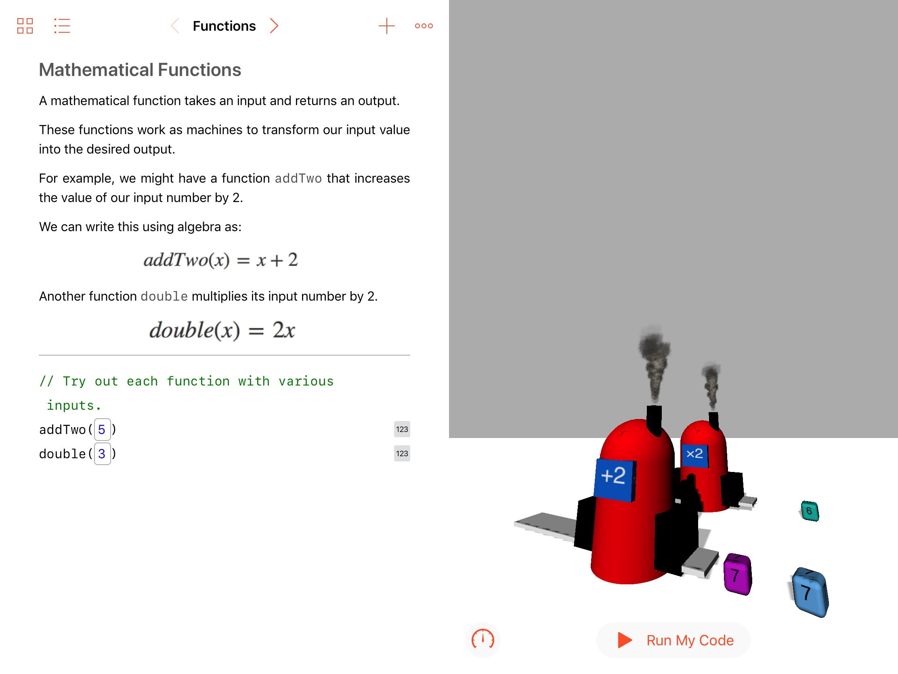

#  WWDC 2018
## Scholarship Application

My scholarship application for WWDC 2018.

The task was to demonstrate technical ability and creativity using a Swift Playground.

The Playground should provide an experience that can be assessed within 3 minutes.

### Tell us about the features and technologies you used in your Swift playground.

My Swift Playground is designed as a lesson plan for a high school mathematics lesson.
The lesson in question teaches the basics of mathematical functions using the concept of function machines. The content is probably most relevant for students around UK Year 8 (US 7th Grade), but may also be useful for beginner programmers who want to learn more about purely mathematical functions.

In order to produce an immersive experience, I have used several of the features and technologies available in Swift Playgrounds. To begin with, the Playground Support module proved particularly useful. Giving feedback and allowing the user to request hints if necessary means the students’ learning can be less guided and more exploratory.

Additionally, SceneKit has been used to produce an interactive, 3D world that can be explored. Rather than the function machines being an abstract concept on a paper worksheet, they are a seemingly physical object that takes an input cube and converts it. SceneKit has allowed for convincing effects, such as the machine setting on fire when it receives an invalid input, to be implemented with ease. In order to further improve the user experience, SceneKit has also given me the ability to add sound effects (Credit: https://www.freesoundeffects.com) with minimal additional lines of code. Achieving good user experience is particularly important in this Playground as will ensure that the student finishes the lesson and learns the content.

Finally, I have used ARKit to bring my SceneKit content into the real world. This feature encourages the user to stand up and examine their function machines. Standing up in class has been shown to give a ~12% increase in student's 'on task' engagement, which means that this AR integration could even improve the student's ability to learn.

### In what ways have you considered sharing your coding knowledge and enthusiasm for computer science with others?

I am avid enthusiast for Computer Science having been studying the subject for several years. I attempt to regularly share my knowledge in several ways. Firstly, I try to release any non-sensitive projects I may have worked on, including past university assignments, as open source on my GitHub account (https://www.github.com/oliver-binns). I have enjoyed producing my Swift Playground for this application and I'm hoping to create more Playground lessons in the future, in the meantime I have made this one available for download from my GitHub profile.

I also attempt to share my enthusiasm for computer science by volunteering at various events. This year I have been regularly working at open days for my department at university. In this role, I have been giving guided tours round the departments and giving presentations on my experiences both on industrial placements and at university. In addition to this I recently volunteered at iOScon 18 in London, helping to facilitate the smooth running of the conference. I was responsible for liasing with the speakers to ensure that their talks kept to time, and helping to run the Q&A after each speaker. Since this conference, I have attempted to share much of my new knowledge with friends who are interested in iOS development.

Some of my side projects also relate to my enthusiasm for computer science, I have produced an iOS app called Codepad, which allows users to view and edit code in a wide variety of languages from their mobile devices. I also regularly take part in hackathons organised by my department and often encourage my friends from other departments, such as electronics, to join in and improve their programming abilities.

Finally, I have been a member of a group of past scholars, originating from WWDC15, who encourage others to code and apply for WWDC scholarships. Together we have produced a website and iOS native app, both of which are kept open source to help others. Within this team, I have been mostly responsible for website development.
